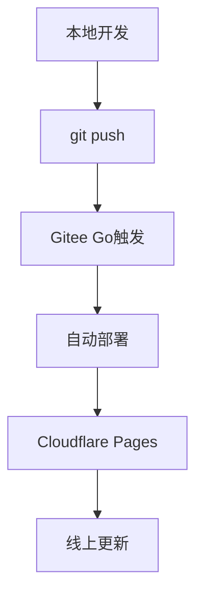

# 🚀 自动部署配置完成

## ✅ 当前状态

- **代码已推送：** ✅ 最新改动已推送到Gitee主仓库
- **自动部署：** ✅ Gitee Go CI/CD已配置完成
- **Cloudflare Pages：** ✅ 已连接并配置

## 🔧 自动部署流程

### 1. Gitee Go配置

已在 `.gitee/go.yml` 中配置了自动部署流程，当代码推送到 `main` 分支时，会自动：

1. 检出最新代码
2. 安装Node.js环境
3. 安装Wrangler CLI
4. 自动部署到Cloudflare Pages

### 2. 需要配置的密钥

在Gitee项目设置中添加以下密钥：

1. **进入项目设置：**
   - 访问：https://gitee.com/starry3085/attendance-tracker
   - 点击「管理」→「Gitee Go」→「变量和密钥」

2. **添加密钥：**
   - `CLOUDFLARE_API_TOKEN`：你的Cloudflare API令牌
   - `CLOUDFLARE_ACCOUNT_ID`：你的Cloudflare账户ID

### 3. 获取Cloudflare凭据

#### 获取API Token：
```bash
# 访问：https://dash.cloudflare.com/profile/api-tokens
# 创建令牌，使用「编辑Cloudflare Workers」模板
```

#### 获取Account ID：
```bash
# 访问：https://dash.cloudflare.com/
# 在右侧边栏可以看到Account ID
```

## 🎯 使用方法

### 日常开发流程：

1. **本地开发：**
   ```bash
   # 修改代码
   git add .
   git commit -m "feat: 新功能描述"
   git push origin main
   ```

2. **自动部署：**
   - Gitee Go会自动触发部署
   - 部署状态可在Gitee项目页面查看
   - 部署完成后自动更新到：https://hours-guard.pages.dev

### 手动触发部署：

如果需要手动部署，仍然可以使用：
```bash
npx wrangler pages deploy public --project-name=hours-guard
```

## 📊 部署状态监控

- **Gitee Go状态：** https://gitee.com/starry3085/attendance-tracker/builds
- **Cloudflare Pages：** https://dash.cloudflare.com/pages/hours-guard
- **实时访问：** https://hours-guard.pages.dev

## 🔄 工作流程



## 🆘 故障排除

### 如果部署失败：
1. 检查Gitee Go日志
2. 验证Cloudflare凭据是否正确
3. 确认wrangler.toml配置
4. 检查网络连接

### 常见错误：
- `Invalid API Token`：重新生成API令牌
- `Account ID not found`：检查账户ID是否正确
- `Project not found`：确认Cloudflare Pages项目已创建